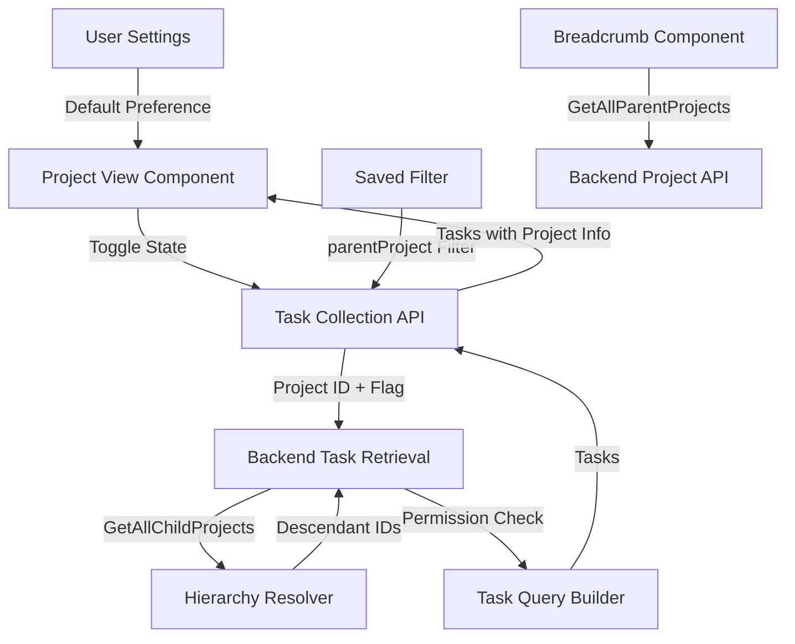

# Design Document: Child Project Tasks Feature

## Overview

This feature adds hierarchical project task visibility to Vikunja, enabling users to view tasks from child projects within parent project views and to filter saved views by parent project with recursive child inclusion. The implementation leverages existing patterns: recursive CTEs for hierarchy resolution (similar to `GetAllParentProjects`), the saved filter multi-project aggregation system, and the frontend settings JSON storage.

**Core Capabilities:**
- Toggle control in project views to show/hide child project tasks
- User preference for default toggle state
- Recursive child project task retrieval with permission checking
- "parentProject" filter for saved filters
- Breadcrumb navigation showing project hierarchy
- Multi-view compatibility (List, Kanban, Gantt, Table)

**Design Principles:**
- Reuse existing patterns (recursive CTEs, filter system, settings storage)
- No database schema changes
- Minimal file modifications
- Follow Vikunja conventions strictly

## Architecture

### High-Level Flow

```
User Action (Toggle/Filter) 
  → Frontend sends request with includeChildTasks flag or parentProject filter
  → Backend resolves project hierarchy (GetAllChildProjects)
  → Backend expands project IDs to include descendants
  → Backend retrieves tasks with permission checking
  → Frontend displays tasks with project indicators
```

### Component Interaction



## Components and Interfaces

### Backend Components

#### 1. Project Hierarchy Resolver

**Location:** `pkg/models/project.go`

**New Function:**
```go
// GetAllChildProjects returns all descendant projects recursively using a CTE
// Similar to GetAllParentProjects but traverses downward
func GetAllChildProjects(s *xorm.Session, projectID int64) (childProjects map[int64]*Project, err error)
```

**Implementation Strategy:**
- Use recursive CTE (Common Table Expression) similar to `GetAllParentProjects`
- Traverse from parent to children instead of child to parent
- Return map of project ID to Project for efficient lookup
- Handle circular references by limiting recursion depth (max 50 levels)
- Cache results using existing Vikunja caching patterns

**SQL Pattern:**
```sql
WITH RECURSIVE child_projects AS (
    SELECT p.* FROM projects p WHERE p.id = ?
    UNION ALL
    SELECT p.* FROM projects p
    INNER JOIN child_projects cp ON p.parent_project_id = cp.id
)
SELECT DISTINCT * FROM child_projects
```

#### 2. Task Collection Enhancement

**Location:** `pkg/models/task_collection.go`

**Modifications:**
- Add `IncludeChildTasks bool` field to `TaskCollection` struct
- Add `ParentProjectIDs []int64` field for parentProject filter support
- Modify `getRelevantProjectsFromCollection` to expand project IDs when `IncludeChildTasks` is true or `ParentProjectIDs` is set

**Logic:**
```go
// In getRelevantProjectsFromCollection
if tf.IncludeChildTasks && tf.ProjectID != 0 {
    childProjects, err := GetAllChildProjects(s, tf.ProjectID)
    // Add child project IDs to projects list
}

// For parentProject filter
if len(tf.ParentProjectIDs) > 0 {
    for _, parentID := range tf.ParentProjectIDs {
        childProjects, err := GetAllChildProjects(s, parentID)
        // Add parent and all children to projects list
    }
}
```

#### 3. Filter System Integration

**Location:** `pkg/models/task_collection.go` (filter parsing)

**New Filter Field:**
- Add support for `parentProject` filter field in filter parser
- Map `parentProject` filter values to `ParentProjectIDs` field
- Integrate with existing filter combination logic (AND/OR)

**Filter Syntax:**
```
filter=parentProject = 123
filter=parentProject in 123,456
```

#### 4. Permission Checking

**Location:** `pkg/models/tasks.go` (task retrieval)

**Enhancement:**
- When expanding project IDs to include children, check read permissions for each child project
- Exclude projects where user lacks read permission
- Use existing `CanRead` interface methods
- Maintain permission check at model level (existing pattern)

**Logic:**
```go
// Filter child projects by permission
permittedProjects := []*Project{}
for _, childProject := range childProjects {
    canRead, _, err := childProject.CanRead(s, a)
    if err != nil {
        return err
    }
    if canRead {
        permittedProjects = append(permittedProjects, childProject)
    }
}
```

#### 5. API Endpoint Modifications

**Location:** `pkg/routes/api/v1/` (task collection routes)

**Changes:**
- Accept `include_child_tasks` query parameter in project task endpoints
- Accept `parent_project` filter field in saved filter endpoints
- Map query parameters to `TaskCollection` fields
- Follow existing API conventions (snake_case for query params)

### Frontend Components

#### 1. User Settings Enhancement

**Location:** `frontend/src/modelTypes/IUserSettings.ts`

**Modification:**
```typescript
export interface IFrontendSettings {
    // ... existing fields
    showChildProjectTasksByDefault: boolean  // New field
}
```

**Default Value:** `false`

**Storage:** Persisted in `User.FrontendSettings` JSON field (no DB schema change)

#### 2. Project View Toggle Component

**Location:** `frontend/src/components/project/` (new or modify existing filter component)

**Implementation:**
- Add toggle control similar to "Show tasks without a date"
- Initialize from `userSettings.frontendSettings.showChildProjectTasksByDefault`
- Store toggle state in component local state (not persisted per-project)
- Include in all view types: List, Kanban, Gantt, Table
- Pass toggle state to task collection API via `include_child_tasks` parameter

**UI Pattern:**
```vue
<fancycheckbox
    v-model="showChildProjectTasks"
    @update:modelValue="loadTasks"
>
    {{ $t('project.show_child_project_tasks') }}
</fancycheckbox>
```

#### 3. Settings Page Enhancement

**Location:** `frontend/src/views/user/settings/`

**Modification:**
- Add checkbox for "Show tasks in child projects by default"
- Place in view-related settings section
- Bind to `userSettings.frontendSettings.showChildProjectTasksByDefault`
- Save via existing user settings API

#### 4. Saved Filter UI Enhancement

**Location:** `frontend/src/components/tasks/filters/` (filter editor)

**Modification:**
- Add "Parent Project" filter option to filter dropdown
- Description: "The project the task belongs to and all tasks from all descendant child projects"
- Use existing project picker component
- Map to `parentProject` filter field in API request

#### 5. Breadcrumb Navigation Component

**Location:** `frontend/src/components/project/` (new component)

**Implementation:**
- Fetch parent chain using existing `GetAllParentProjects` API
- Display as: "Root Project > Parent Project > Current Project"
- Make each project name clickable (navigate to project view)
- Show only for child projects (hide for root projects)
- Position consistently across all view types

**Component Structure:**
```vue
<nav class="breadcrumb">
    <ul>
        <li v-for="project in parentChain" :key="project.id">
            <router-link :to="{ name: 'project.index', params: { projectId: project.id }}">
                {{ project.title }}
            </router-link>
        </li>
        <li class="is-active">
            <a>{{ currentProject.title }}</a>
        </li>
    </ul>
</nav>
```

#### 6. Task Display Enhancement

**Location:** `frontend/src/components/tasks/` (task list/card components)

**Modification:**
- Display project name/indicator for tasks from child projects
- Use existing project display patterns
- Ensure visual distinction from parent project tasks
- Apply to all view types

## Data Models

### Backend Model Changes

**TaskCollection Struct** (`pkg/models/task_collection.go`):
```go
type TaskCollection struct {
    // ... existing fields
    IncludeChildTasks bool    `query:"include_child_tasks" json:"include_child_tasks"`
    ParentProjectIDs  []int64 `json:"-"` // Populated from filter parsing
}
```

**No Database Schema Changes Required**

### Frontend Model Changes

**IFrontendSettings Interface** (`frontend/src/modelTypes/IUserSettings.ts`):
```typescript
export interface IFrontendSettings {
    // ... existing fields
    showChildProjectTasksByDefault: boolean
}
```

**ITaskCollection Interface** (if exists, or API service):
```typescript
interface TaskCollectionParams {
    // ... existing fields
    include_child_tasks?: boolean
}
```

## Correctness Properties

*A property is a characteristic or behavior that should hold true across all valid executions of a system—essentially, a formal statement about what the system should do. Properties serve as the bridge between human-readable specifications and machine-verifiable correctness guarantees.*

### Property 1: Hierarchy Resolution Completeness

*For any* project with descendant projects at depth N, calling `GetAllChildProjects` SHALL return all projects at all depth levels from 1 to N, including the original project.

**Validates: Requirements 3.1, 3.4, 7.1**

### Property 2: Task Inclusion Based on Toggle State

*For any* project hierarchy, when `IncludeChildTasks` is false, the returned tasks SHALL contain only tasks where `task.project_id` equals the requested project ID. When `IncludeChildTasks` is true, the returned tasks SHALL contain tasks where `task.project_id` equals the requested project ID or any descendant project ID.

**Validates: Requirements 1.2, 1.3, 3.2, 4.3**

### Property 3: Preference Persistence Round-Trip

*For any* boolean value assigned to `showChildProjectTasksByDefault`, saving the user settings and then retrieving them SHALL return the same boolean value.

**Validates: Requirements 2.3**

### Property 4: Filter Combination Correctness

*For any* saved filter containing a `parentProject` filter combined with other filter criteria, the returned tasks SHALL satisfy both the parentProject condition (task belongs to parent or descendant) AND/OR the other filter conditions according to the specified filter logic.

**Validates: Requirements 4.5**

### Property 5: Permission-Based Task Filtering

*For any* project hierarchy where the user has read permission on a subset of projects, the returned tasks SHALL include only tasks from projects where `CanRead` returns true, excluding all tasks from projects where `CanRead` returns false.

**Validates: Requirements 10.1, 10.2**

### Property 6: Cache Invalidation on Hierarchy Change

*For any* project hierarchy, after modifying a project's `parent_project_id`, subsequent calls to `GetAllChildProjects` for affected projects SHALL return the updated hierarchy, not cached stale data.

**Validates: Requirements 7.4**

## Error Handling

### Backend Error Scenarios

1. **Circular Reference Detection**
   - **Scenario:** Project hierarchy contains a cycle (A → B → C → A)
   - **Handling:** Limit recursion depth to 50 levels, log warning, return projects found up to limit
   - **Error:** Return `ErrCircularProjectHierarchy` if cycle detected

2. **Permission Denied**
   - **Scenario:** User requests child tasks but lacks permission on parent project
   - **Handling:** Return existing `ErrUserDoesNotHaveAccessToProject` error
   - **HTTP Status:** 403 Forbidden

3. **Invalid Project ID**
   - **Scenario:** Requested project ID does not exist
   - **Handling:** Return existing `ErrProjectDoesNotExist` error
   - **HTTP Status:** 404 Not Found

4. **Database Query Failure**
   - **Scenario:** CTE query fails (database error)
   - **Handling:** Log error, return internal server error
   - **HTTP Status:** 500 Internal Server Error

5. **Large Hierarchy Warning**
   - **Scenario:** Project has more than 100 descendants
   - **Handling:** Log performance warning, continue processing
   - **No Error:** Process normally but log for monitoring

### Frontend Error Scenarios

1. **API Request Failure**
   - **Scenario:** Task retrieval with child tasks fails
   - **Handling:** Display error message, fall back to showing only parent tasks
   - **User Message:** "Failed to load child project tasks"

2. **Settings Save Failure**
   - **Scenario:** User preference update fails
   - **Handling:** Display error message, revert toggle to previous state
   - **User Message:** "Failed to save preference"

3. **Invalid Filter Configuration**
   - **Scenario:** parentProject filter references non-existent project
   - **Handling:** Display validation error, prevent filter save
   - **User Message:** "Selected project does not exist"

## Testing Strategy

### Unit Tests (Backend)

**Focus Areas:**
- `GetAllChildProjects` function with various hierarchy structures
- Permission checking logic for child projects
- Filter parsing for `parentProject` field
- Cache invalidation on hierarchy changes
- Edge cases: empty hierarchies, single-level, deep nesting

**Example Tests:**
```go
func TestGetAllChildProjects_SingleLevel(t *testing.T)
func TestGetAllChildProjects_MultiLevel(t *testing.T)
func TestGetAllChildProjects_NoChildren(t *testing.T)
func TestGetAllChildProjects_CircularReference(t *testing.T)
func TestTaskCollection_IncludeChildTasks_PermissionFiltering(t *testing.T)
func TestParentProjectFilter_Integration(t *testing.T)
```

### Property-Based Tests (Backend)

**Library:** Use `gopter` (Go property-based testing library)

**Configuration:** Minimum 100 iterations per property test

**Property Test 1: Hierarchy Resolution Completeness**
```go
// Feature: child-project-tasks, Property 1: For any project with descendant projects at depth N, 
// calling GetAllChildProjects SHALL return all projects at all depth levels from 1 to N
func TestProperty_HierarchyResolutionCompleteness(t *testing.T)
```

**Property Test 2: Task Inclusion Based on Toggle State**
```go
// Feature: child-project-tasks, Property 2: For any project hierarchy, when IncludeChildTasks is false,
// returned tasks contain only direct tasks; when true, includes all descendant tasks
func TestProperty_TaskInclusionByToggleState(t *testing.T)
```

**Property Test 3: Preference Persistence Round-Trip**
```go
// Feature: child-project-tasks, Property 3: For any boolean value assigned to showChildProjectTasksByDefault,
// saving and retrieving SHALL return the same value
func TestProperty_PreferencePersistenceRoundTrip(t *testing.T)
```

**Property Test 4: Filter Combination Correctness**
```go
// Feature: child-project-tasks, Property 4: For any saved filter with parentProject and other criteria,
// returned tasks satisfy both conditions with correct AND/OR logic
func TestProperty_FilterCombinationCorrectness(t *testing.T)
```

**Property Test 5: Permission-Based Task Filtering**
```go
// Feature: child-project-tasks, Property 5: For any project hierarchy with mixed permissions,
// returned tasks include only tasks from projects where CanRead returns true
func TestProperty_PermissionBasedTaskFiltering(t *testing.T)
```

**Property Test 6: Cache Invalidation on Hierarchy Change**
```go
// Feature: child-project-tasks, Property 6: For any project hierarchy, after modifying parent_project_id,
// subsequent GetAllChildProjects calls return updated hierarchy
func TestProperty_CacheInvalidationOnHierarchyChange(t *testing.T)
```

### Integration Tests (Backend)

**Focus Areas:**
- End-to-end task retrieval with child inclusion via API
- Saved filter with parentProject field
- Permission enforcement across hierarchy
- Multi-project aggregation with child tasks

**Example Tests:**
```go
func TestAPI_ProjectTasks_WithChildInclusion(t *testing.T)
func TestAPI_SavedFilter_ParentProject(t *testing.T)
func TestAPI_ChildTasks_PermissionDenied(t *testing.T)
```

### Unit Tests (Frontend)

**Focus Areas:**
- Toggle state initialization from user preference
- Settings component preference binding
- Filter editor parentProject option
- Breadcrumb navigation rendering

**Example Tests:**
```typescript
describe('ProjectView Toggle', () => {
  it('initializes from user preference')
  it('updates task query on toggle change')
})

describe('UserSettings', () => {
  it('saves showChildProjectTasksByDefault preference')
})

describe('BreadcrumbNavigation', () => {
  it('displays parent chain correctly')
  it('hides for root projects')
})
```

### E2E Tests (Frontend)

**Focus Areas:**
- Toggle visibility in all view types (List, Kanban, Gantt, Table)
- Toggle functionality (show/hide child tasks)
- User preference setting and application
- Saved filter with parentProject
- Breadcrumb navigation and clicking
- Task display with project indicators

**Example Tests:**
```typescript
test('toggle shows child project tasks in list view', async ({ page }) => {})
test('user preference sets default toggle state', async ({ page }) => {})
test('saved filter with parentProject includes child tasks', async ({ page }) => {})
test('breadcrumb navigation shows parent chain', async ({ page }) => {})
test('child tasks display project name', async ({ page }) => {})
```

### Performance Tests

**Focus Areas:**
- Task retrieval time with vs without child inclusion
- Hierarchy resolution for deep nesting (10+ levels)
- Large hierarchies (100+ descendants)
- Query optimization (single query vs N+1)

**Benchmarks:**
```go
func BenchmarkGetAllChildProjects_Depth10(b *testing.B)
func BenchmarkTaskRetrieval_WithChildren_100Projects(b *testing.B)
```

**Acceptance Criteria:**
- Task retrieval with child inclusion ≤ 2x time without child inclusion (up to 10 levels deep)
- Single optimized query (no N+1 pattern)

### Manual Testing Checklist

- [ ] Toggle appears in all view types with consistent styling
- [ ] Toggle placement matches "Show tasks without a date" toggle
- [ ] Breadcrumb navigation displays correctly for child projects
- [ ] Breadcrumb navigation hidden for root projects
- [ ] Child tasks visually distinguishable from parent tasks
- [ ] Settings preference UI follows existing patterns
- [ ] Filter editor parentProject option has correct description
- [ ] UI remains responsive with large hierarchies

## Implementation Notes

### Reusing Existing Patterns

1. **Recursive CTE Pattern**
   - Model after `GetAllParentProjects` in `pkg/models/project.go`
   - Use same caching strategy as existing project queries
   - Follow same error handling patterns

2. **Saved Filter Aggregation**
   - Leverage existing multi-project task aggregation in `getRelevantProjectsFromCollection`
   - Extend project ID expansion logic rather than reimplementing
   - Use existing filter parsing infrastructure

3. **Frontend Settings Storage**
   - Store in `User.FrontendSettings` JSON field (existing pattern)
   - No new database columns required
   - Follow existing settings save/load patterns

4. **Permission Checking**
   - Use existing `CanRead` interface methods
   - Maintain permission checks at model level (existing convention)
   - Reuse permission caching if available

### Performance Considerations

1. **Hierarchy Resolution Caching**
   - Cache `GetAllChildProjects` results with project ID as key
   - Invalidate cache on project parent changes
   - Use existing Vikunja caching infrastructure

2. **Query Optimization**
   - Use `IN` clause with expanded project IDs (single query)
   - Avoid N+1 queries by fetching all projects upfront
   - Leverage existing task query optimizations

3. **Depth Limiting**
   - Set maximum recursion depth to 50 levels
   - Log warning for hierarchies exceeding 100 descendants
   - Prevent infinite loops from circular references

### Migration Considerations

**No Database Migrations Required**

All changes use existing schema:
- `projects.parent_project_id` (already exists)
- `users.frontend_settings` (already exists as JSON)
- Task and filter tables unchanged

### Localization

**Translation Keys to Add:**

Frontend (`frontend/src/i18n/lang/en.json`):
```json
{
  "project": {
    "show_child_project_tasks": "Show tasks in child projects",
    "show_child_project_tasks_description": "Include tasks from all descendant child projects"
  },
  "user": {
    "settings": {
      "show_child_project_tasks_by_default": "Show tasks in child projects by default",
      "show_child_project_tasks_by_default_description": "Automatically enable child project task visibility when viewing projects"
    }
  },
  "filters": {
    "parentProject": "Parent Project",
    "parentProject_description": "The project the task belongs to and all tasks from all descendant child projects"
  }
}
```

Backend (if needed for API errors):
- Reuse existing error messages
- No new backend localization required

## Security Considerations

1. **Permission Enforcement**
   - Always check `CanRead` for each child project
   - Never expose tasks from projects user cannot access
   - Maintain permission checks at model level (defense in depth)

2. **Query Injection Prevention**
   - Use parameterized queries for CTE
   - Validate project IDs before query construction
   - Leverage XORM's built-in SQL injection protection

3. **Circular Reference Protection**
   - Limit recursion depth to prevent DoS
   - Detect and break cycles in hierarchy resolution
   - Log suspicious circular references for monitoring

4. **Information Disclosure**
   - Don't reveal existence of projects user cannot access
   - Filter child projects by permission before returning
   - Maintain consistent error messages (avoid enumeration)

## Deployment Considerations

### Rollout Strategy

1. **Phase 1: Backend API**
   - Deploy backend changes first
   - New API parameters are optional (backward compatible)
   - Existing clients continue working without changes

2. **Phase 2: Frontend UI**
   - Deploy frontend changes after backend is stable
   - Toggle defaults to disabled (no behavior change for existing users)
   - Users opt-in to new functionality

### Backward Compatibility

- All new API parameters are optional
- Existing API behavior unchanged when new parameters not provided
- Frontend settings default to disabled (no surprise behavior changes)
- No breaking changes to existing APIs or data structures

### Monitoring

**Metrics to Track:**
- Hierarchy resolution query performance
- Cache hit/miss rates for child project lookups
- Frequency of large hierarchy warnings (>100 descendants)
- API error rates for child task requests
- User adoption of toggle feature (analytics)

**Alerts:**
- Hierarchy resolution queries exceeding 2x baseline
- High rate of circular reference detections
- Permission check failures spike

### Rollback Plan

If issues arise:
1. Disable feature via feature flag (if implemented)
2. Frontend: Hide toggle UI (CSS or component flag)
3. Backend: Ignore `include_child_tasks` parameter
4. No data rollback needed (no schema changes)

## Future Enhancements

See `FUTURE_ENHANCEMENTS.md` for planned improvements not in scope for this implementation:
- Per-project toggle state persistence
- Configurable hierarchy depth limits
- Bulk operations on child project tasks
- Performance optimizations for very large hierarchies
- Advanced filtering options (depth limits, specific child selection)
